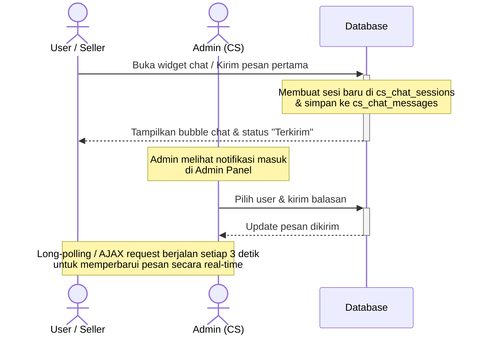

# Rencana Implementasi: Fitur Chat Customer Service (CS) Real-Time

Menambahkan fitur live chat interaktif antara Pengguna (User/Seller) dan Admin (Customer Service) untuk membantu menyelesaikan kendala transaksi, penarikan dana, atau pertanyaan umum secara langsung di platform.

---

## 1. Alur & Sistem Kerja (Workflow)

### A. Sisi User (Pembeli & Penjual)
* Terdapat **floating widget chat** di pojok kanan bawah layar pada seluruh halaman utama (pembeli) dan panel seller.
* Pengguna harus **Login** terlebih dahulu untuk menggunakan fitur ini agar riwayat chat tersimpan berdasarkan `id_user`. Jika belum login, tombol chat akan menampilkan pesan untuk login terlebih dahulu.
* Setiap kali pengguna mengirimkan pesan pertama, sistem akan otomatis membuat **Sesi Chat Baru** (`cs_chat_sessions`) yang berstatus `active`.

### B. Sisi Admin (Customer Service)
* Menu baru **"CS Chat Support"** ditambahkan pada sidebar Admin Panel.
* Admin memiliki dashboard inbox berisi daftar user yang sedang aktif mengirim pesan, lengkap dengan indikator pesan belum terbaca (*unread badge*).
* Admin dapat mengklik salah satu user untuk membuka jendela percakapan, membaca riwayat, dan membalas chat tersebut secara langsung.
* Admin dapat mengubah status sesi menjadi `closed` (selesai) jika permasalahan user sudah terselesaikan.

---

## 2. Struktur Database (Tabel Baru)

Dua tabel baru akan ditambahkan ke database `topup_game`:

### `cs_chat_sessions` (Mengelola Sesi Percakapan)
| Kolom | Tipe Data | Keterangan |
| :--- | :--- | :--- |
| `id_session` | INT (PK, Auto Increment) | ID Sesi Chat |
| `id_user` | INT (FK -> `user.id_user`) | ID User yang memulai chat |
| `status` | ENUM('active', 'closed') | Status sesi chat (default: 'active') |
| `created_at` | DATETIME | Waktu sesi dibuat |
| `updated_at` | DATETIME | Waktu aktivitas terakhir |

### `cs_chat_messages` (Menyimpan Detail Pesan)
| Kolom | Tipe Data | Keterangan |
| :--- | :--- | :--- |
| `id_message` | INT (PK, Auto Increment) | ID Pesan |
| `id_session` | INT (FK -> `cs_chat_sessions`) | Menghubungkan ke sesi chat |
| `sender_role` | ENUM('user', 'admin') | Siapa pengirimnya (User atau Admin) |
| `message` | TEXT | Isi teks pesan |
| `is_read` | TINYINT (1) | Status dibaca (0 = belum, 1 = sudah) |
| `created_at` | DATETIME | Waktu pesan dikirim |

---

## 3. Lokasi Perubahan File & Menu

### A. Halaman User & Seller (Frontend)
Untuk meminimalkan redundansi kode, kita akan membuat satu file widget chat reusable, kemudian meng-include-kannya ke file-file berikut:
* **File Baru:** `components/chat_widget.php` (Berisi UI Floating Chat Widget & Logic AJAX-nya).
* **File Baru:** `api/chat_handler.php` (Handler backend untuk menerima pesan dari user, get riwayat chat, dan polling pesan baru).
* **Modifikasi File (Include Chat Widget sebelum tag `</body>`):**
  * Halaman Utama: [index.php](file:///c:/laragon/www/TopUpin/index.php)
  * Katalog: [catalog.php](file:///c:/laragon/www/TopUpin/catalog.php)
  * Detail Produk: [detail.php](file:///c:/laragon/www/TopUpin/detail.php)
  * Pembayaran: [pembayaran.php](file:///c:/laragon/www/TopUpin/pembayaran.php)
  * Riwayat Belanja: [riwayat.php](file:///c:/laragon/www/TopUpin/riwayat.php)
  * Halaman Seller: [seller/dashboard.php](file:///c:/laragon/www/TopUpin/seller/dashboard.php) (serta file seller lainnya seperti `produk.php`, `dompet.php`, dan `transaksi.php`).

### B. Halaman Admin (Backend Panel)
* **File Baru:** `admin/chat.php` (Halaman utama kelola inbox chat & ruang percakapan admin).
* **File Baru:** `admin/api/chat_handler.php` (Handler backend untuk admin: ambil daftar user, ambil riwayat chat, kirim balasan, dan tandai sudah dibaca).
* **Modifikasi File (Tambah menu "CS Chat" ke Sidebar):**
  * [admin/dashboard.php](file:///c:/laragon/www/TopUpin/admin/dashboard.php)
  * [admin/produk.php](file:///c:/laragon/www/TopUpin/admin/produk.php)
  * [admin/transaksi.php](file:///c:/laragon/www/TopUpin/admin/transaksi.php)
  * [admin/penarikan.php](file:///c:/laragon/www/TopUpin/admin/penarikan.php)

---

## 4. Rencana Desain Antarmuka (UI/UX)

* **User Widget:**
  * Tombol bulat melayang (floating button) di pojok kanan bawah berwarna ungu indigo (`bg-indigo-600`) dengan ikon chat (`fa-comments`).
  * Ketika diklik, akan membuka box chat kecil (350px x 450px) dengan gaya Glassmorphism modern yang serasi dengan desain tema gelap (Dark Theme) platform TopUpin.
  * Dilengkapi tombol "Kirim" dan input area yang responsif.
* **Admin Dashboard:**
  * Layout split-screen 2 kolom:
    * **Kolom Kiri:** Daftar user yang mengirim chat diurutkan berdasarkan pesan terbaru masuk, dilengkapi indikator warna hijau jika ada pesan belum dibaca.
    * **Kolom Kanan:** Ruang obrolan terpilih dengan header info user (Nama & Email) serta riwayat pesan bergaya bubble chat (Kiri = User, Kanan = Admin).

---

## 5. Rencana Verifikasi & Pengujian
1. **Verifikasi Database:** Jalankan script migrasi baru untuk membuat tabel database `cs_chat_sessions` dan `cs_chat_messages`.
2. **Uji Pengiriman Pesan (User):** Buka `http://localhost:8000/`, login sebagai user biasa, kirim pesan melalui widget chat, pastikan tersimpan di database.
3. **Uji Penerimaan & Balasan (Admin):** Masuk ke `http://localhost:8000/admin/chat.php`, pilih user tadi, balas pesan, pastikan pesan terkirim.
4. **Uji Polling Real-Time:** Buka dua browser bersebelahan (satu sebagai user, satu sebagai admin). Kirim pesan dari salah satu sisi, pastikan pesan langsung muncul di sisi lain dalam waktu < 3 detik tanpa refresh halaman.
